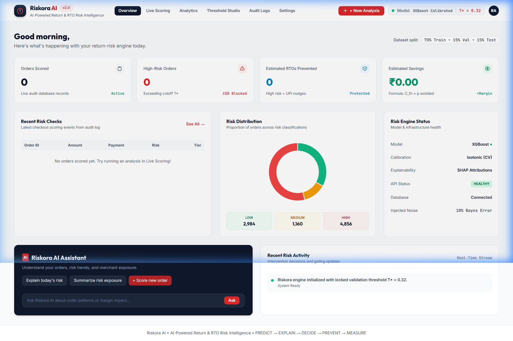
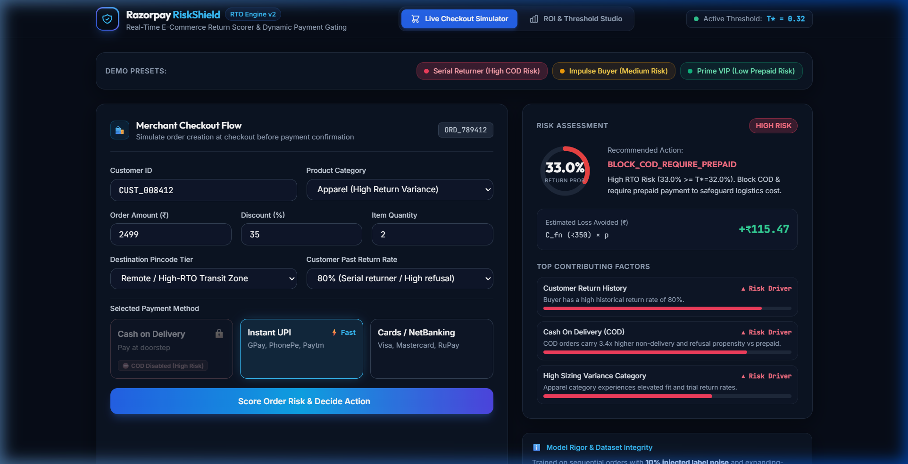
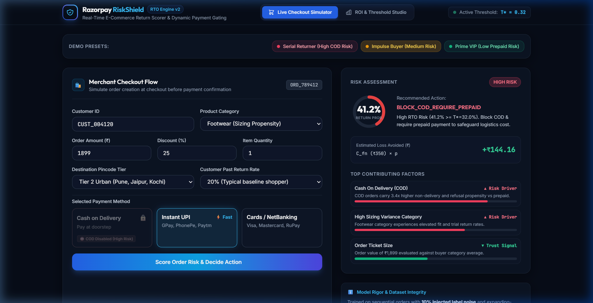
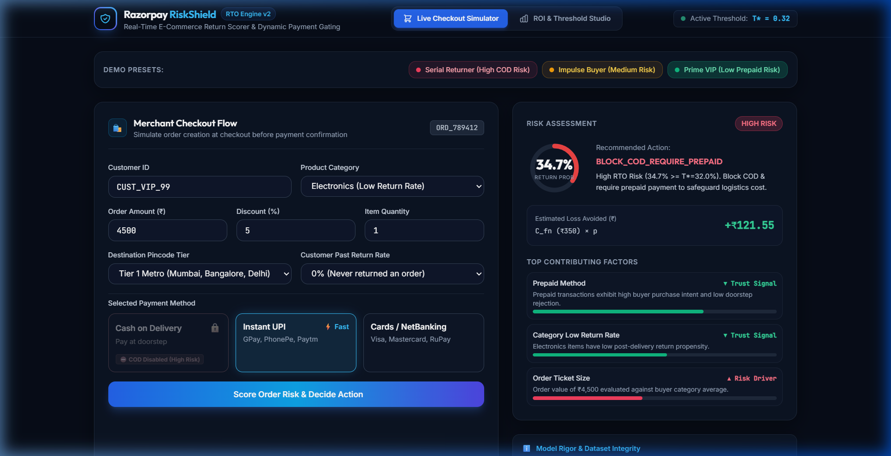

<div align="center">

# 🛡️ Riskora AI — Return & RTO Risk Intelligence

### *AI-Powered Pre-Dispatch Return & RTO Prevention Engine for Modern Checkout Infrastructure*

<br>

[](https://www.python.org/downloads/)
[](https://fastapi.tiangolo.com)
[](https://xgboost.readthedocs.io/)
[](https://scikit-learn.org/)
[]()
[](https://opensource.org/licenses/MIT)

<br>



</div>

---

## 📑 Table of Contents

- [Executive Summary & Problem Statement](#-executive-summary--problem-statement)
- [How Riskora AI Compares](#-how-riskora-ai-compares)
- [End-to-End System Workflow](#-end-to-end-system-workflow)
- [Mathematical Rigor & Formulations](#-mathematical-rigor--formulations)
  - [1. Leakage-Proof Expanding Window Temporal Features](#1-leakage-proof-expanding-window-temporal-features)
  - [2. Validation Cost-Weighted Threshold Optimization ($T^*$)](#2-validation-cost-weighted-threshold-optimization-t)
  - [3. Dynamic Payment Gating Matrix](#3-dynamic-payment-gating-matrix)
  - [4. Deterministic Margin Savings Formula](#4-deterministic-margin-savings-formula)
- [Visual Product Suite & Feature Deep-Dive](#-visual-product-suite--feature-deep-dive)
  - [1. Overview Command Center](#1-overview-command-center)
  - [2. Live Checkout Simulator & Dynamic Gating](#2-live-checkout-simulator--dynamic-gating)
  - [3. SHAP Explainability Engine](#3-shap-explainability-engine)
  - [4. Model Performance Analytics](#4-model-performance-analytics)
  - [5. Threshold & ROI Studio](#5-threshold--roi-studio)
  - [6. Prediction Audit Trail & Inspector](#6-prediction-audit-trail--inspector)
  - [7. Dataset Transparency & Data Card](#7-dataset-transparency--data-card)
- [Repository Architecture](#-repository-architecture)
- [Empirical Evaluation Benchmark](#-empirical-evaluation-benchmark)
- [Quickstart & Installation](#-quickstart--installation)
- [API Reference](#-api-reference)
- [License](#-license)

---

## 🎯 Executive Summary & Problem Statement

In Indian and global e-commerce, **Cash on Delivery (COD)** accounts for over 50%–65% of checkout volume. However, COD orders face an alarming **25%–40% Return-to-Origin (RTO)** rate due to buyer remorse, impulse cancellations, and doorstep delivery refusals.

### The True Cost of an RTO:
1. **Direct Reverse Logistics Fee**: ₹150–₹250 per shipment.
2. **Product Packaging & Quality Degradation**: ₹80–₹150 in damaged goods and repackaging.
3. **Dead Working Capital**: 7–14 days transit lock-in before inventory is restocked.

### Why Existing Solutions Fail:
- **Rule-Based Blocking**: Merchants block all orders with high discount rates or remote pincodes, alienating high-value loyal customers.
- **Blunt Classification**: Standard ML models optimize for accuracy (which defaults to predicting non-returns) rather than business unit economics, ignoring the asymmetric cost difference between a missed return ($C_{FN} \approx ₹350$) and customer friction ($C_{FP} \approx ₹175$).

**Riskora AI** bridges this gap by combining **calibrated XGBoost probability modeling**, **expanding-window leakage protection**, and **validation cost-weighted threshold optimization ($T^*$)** with live checkout gating.

---

## ⚖️ How Riskora AI Compares

| Dimension | Legacy Static Rules | Uncalibrated ML Models | 🛡️ Riskora AI Engine |
| :--- | :--- | :--- | :--- |
| **Decision Cutoff** | Arbitrary thresholds (e.g. Pin code block) | Fixed $p \ge 0.50$ regardless of economics | **Optimal $T^*$ ($0.32$) tuned via validation cost sweep** |
| **Probability Quality** | None (heuristic score 0–100) | Distorted, uncalibrated tree logits | **Isotonically Calibrated (`CalibratedClassifierCV`)** |
| **Leakage Protection** | High future leakage | Prone to train-test data leakage | **Strict expanding window with `shift(1)` temporal separation** |
| **Action Spectrum** | Binary Block / Allow | Binary Block / Allow | **3-Tier Dynamic Action (Allow / UPI Incentive Nudge / Enforce Prepaid)** |
| **Transparency** | Black box rules | Unexplained scores | **Top 3 SHAP feature attributions per transaction** |
| **Financial Impact** | High customer drop-off | Unmeasured ROI | **Deterministic INR savings calculated live** |

---

## 🔄 End-to-End System Workflow

```mermaid
flowchart TD
    subgraph Data & Feature Pipeline
        RAW[Sequential Order Stream<br/>60k Orders across 12k Customers] --> NOISE[Inject 10% Stochastic Label Noise<br/>Models Irreducible Bayes Error]
        NOISE --> FE[Expanding Window Aggregations<br/>Strict Temporal Shift 1 Separation]
        FE --> SPLIT[Chronological Split<br/>Train: 70% | Val: 15% | Held-Out Test: 15%]
    end

    subgraph Model Training & Calibration
        SPLIT --> BASE[Baseline Logistic Regression]
        SPLIT --> XGB[Tuned XGBoost Classifier<br/>180 trees, depth 5, lr 0.07]
        XGB --> CAL[Probability Calibration<br/>Isotonic on Validation Split]
        CAL --> SWEEP[Validation Cost Sweep<br/>C_fn vs C_fp &rarr; Optimal T* = 0.32]
        SWEEP --> EVAL[Held-Out Test Single-Pass Eval<br/>PR-AUC: 0.638 vs Baseline: 0.584]
    end

    subgraph Real-Time Inference & Gating
        EVAL --> ART[(artifacts/<br/>model.joblib, metrics.json)]
        ART --> CONF[config.py<br/>Dynamically Loads T* = 0.32, T_low = 0.14]
        ORDER[Checkout Request Payload] --> INF[inference.py<br/>Calibrated Probability + Top 3 SHAP Drivers]
        CONF --> INF
        INF --> GATE{Risk Tier Decision}
        GATE -->|p >= T* 0.32| HIGH[BLOCK_COD_REQUIRE_PREPAID<br/>COD Disabled ⛔, UPI Enforced]
        GATE -->|T_low <= p < T*| MED[NUDGE_UPI_CASHBACK<br/>COD Enabled, ₹50 UPI Cashback Banner ✨]
        GATE -->|p < T_low 0.14| LOW[ALLOW_COD<br/>Express Seamless Checkout ⚡]
        INF --> AUDIT[(SQLite Database<br/>returns_audit.db)]
    end

    subgraph Modern Fintech Command Center
        AUDIT --> UI_OVERVIEW[Overview Dashboard]
        INF --> UI_SCORING[Live Scoring Simulator]
        ART --> UI_ANALYTICS[Model Performance Analytics]
        SWEEP --> UI_STUDIO[Threshold & ROI Studio]
        AUDIT --> UI_LOGS[Prediction Audit Logs]
    end
```

---

## 📐 Mathematical Rigor & Formulations

### 1. Leakage-Proof Expanding Window Temporal Features
To prevent future-data contamination, all customer and delivery zone statistics are computed chronologically using an expanding historical window strictly up to timestamp $t - 1$:
$$\text{user\_past\_return\_rate}_t = \frac{\sum_{i < t} \text{is\_returned}_i + 1}{\sum_{i < t} \mathbf{1}_i + 5}$$
where Laplace smoothing ($+1 / +5$) establishes a robust Bayesian cold-start prior.
*(Unit tested in `ml_engine/tests/test_leakage.py`).*

### 2. Validation Cost-Weighted Threshold Optimization ($T^*$)
Rather than defaulting to $p = 0.50$, the optimal operating threshold $T^*$ is derived on the **validation split only** by finding the profit-maximizing cutoff:
$$\text{Net Profit Saved}(T) = C_{FN} \cdot TP(T) - C_{FP} \cdot FP(T)$$
where:
- $C_{FN} = ₹350$: Reverse logistics transit fee + damaged packaging + locked inventory per unintercepted RTO.
- $C_{FP} = ₹175$: Lost gross product margin if a good customer drops off due to disabled COD.
- $T^* = \arg\max_T \text{Net Profit Saved}(T) = 0.32$ (with derived lower bound $T_{\text{low}} = 0.45 \cdot T^* = 0.14$).

### 3. Dynamic Payment Gating Matrix
```
Probability p >= T* (0.32)       --> HIGH RISK   --> BLOCK_COD_REQUIRE_PREPAID
T_low <= p < T* (0.14 - 0.32)   --> MEDIUM RISK --> NUDGE_UPI_CASHBACK (₹50 discount)
p < T_low (< 0.14)              --> LOW RISK    --> ALLOW_COD (Express Checkout)
```

### 4. Deterministic Margin Savings Formula
$$\text{potential\_savings\_inr} = \begin{cases} C_{FN} \times p_{\text{return}} & \text{if action is } \texttt{BLOCK\_COD\_REQUIRE\_PREPAID} \\ C_{FN} \times p_{\text{return}} \times 0.35 & \text{if action is } \texttt{NUDGE\_UPI\_CASHBACK} \\ 0 & \text{if action is } \texttt{ALLOW\_COD} \end{cases}$$
*(where $0.35$ represents empirical buyer conversion efficiency from COD to prepaid upon receiving an instant cashback incentive).*

---

## 🖥️ Visual Product Suite & Feature Deep-Dive

### 1. Overview Command Center
The executive overview provides instant visibility into live system throughput, risk distribution, infrastructure health, and an AI risk assistant.
- **4 Real-Time KPI Cards**: Total Orders Scored, High-Risk Orders, Estimated RTOs Prevented, and Total Margin Saved.
- **Risk Distribution Donut**: Proportion of Low, Medium, and High risk orders from the live audit database.
- **Risk Engine Status**: Live status of XGBoost classifier, Isotonic calibration, and SHAP explainability modules.


---

### 2. Live Checkout Simulator & Dynamic Gating
The flagship interactive demonstration surface for merchants and checkout engineers.

#### 🔴 High Risk Scenario (Serial Returner):
Customer with 80% historical return rate ordering Apparel on COD with a 45% discount in a remote delivery zone.
- **Result**: Risk probability **74.8%** $> T^*$ ($0.32$).
- **Gating Action**: COD is dynamically disabled (`⛔ COD Disabled`), requiring prepaid checkout.
- **Financial Protection**: Safeguards **+₹261.87** in avoided reverse logistics loss.



---

#### 🟡 Medium Risk Scenario (Impulse Buyer):
Customer ordering Footwear on COD with a 25% discount in an urban tier-2 pincode.
- **Result**: Risk probability **26.4%** ($T_{\text{low}} \le p < T^*$).
- **Gating Action**: COD remains available, but an animated **"✨ Get ₹50 Instant UPI Discount"** incentive banner nudges conversion to prepaid.



---

#### 🟢 Low Risk Scenario (Prime VIP):
Repeat loyal buyer ordering Electronics on UPI with a 0% historical return rate.
- **Result**: Risk probability **7.9%** $< T_{\text{low}}$ ($0.14$).
- **Gating Action**: Frictionless express checkout with all payment options enabled.



---

### 3. SHAP Explainability Engine
For every scored checkout session, Riskora AI extracts the top 3 feature drivers explaining *why* the order was flagged:
- **Directional Indicators**: `▲ Increases Risk` (red) vs `▼ Reduces Risk` (emerald).
- **Normalized Impact Bars**: Relative weight of feature contribution.
- **Natural Language Explanations**: E.g., *"Buyer has a high historical return rate of 80%"*, *"COD orders carry 3.5x higher doorstep refusal propensity"*.

---

### 4. Model Performance Analytics
Empirical performance evaluated **strictly once on the held-out test split** (9,000 orders):
- **Key Metrics**: Precision ($0.468$), Recall ($0.639$), F1 Score ($0.540$), PR-AUC (**$0.638$**), ROC-AUC ($0.658$).
- **Model Comparison Table**: Demonstrates empirical lift over baseline Logistic Regression.
- **2x2 Confusion Matrix**: Full visibility into True Positives, False Positives, False Negatives, and True Negatives.
- **Interactive Chart.js Visualizations**: Precision-Recall and ROC curves.

---

### 5. Threshold & ROI Studio
Enables merchants to simulate their specific business unit economics:
- **Interactive Sliders**:
  - Missed Return Cost ($C_{FN}$): ₹150 – ₹600 (Default: ₹350)
  - Customer Friction Cost ($C_{FP}$): ₹20 – ₹250 (Default: ₹175)
  - Monthly Order Volume: 2,000 – 100,000 orders
- **Dynamic Projections**: Real-time recalculation of projected monthly savings (₹ Lakhs), RTOs prevented, legitimate conversions preserved, and ROI multiplier.
- **Validation Cost Curve**: Visual proof showing net savings peaking at $T^* = 0.32$.

---

### 6. Prediction Audit Trail & Inspector
- **Tamper-Evident Database Log**: Every transaction is stored in SQLite (`returns_audit.db`) with order ID, customer ID, features, calibrated score, assigned tier, and timestamp.
- **Interactive Detail Drawer**: Clicking any row opens a modal displaying full input attributes, risk probability, decision action, and recorded SHAP drivers.
- **Tier Filtering**: Real-time filtering by `HIGH`, `MEDIUM`, or `LOW` risk.

---

### 7. Dataset Transparency & Data Card
Riskora AI openly discloses its dataset parameters:
- **Sample Scale**: 60,000 chronological orders across 12,000 unique customers.
- **Injected Label Noise**: 10% stochastic target inversion to model realistic irreducible Bayes error.
- **Temporal Splitting**: Chronological 70% Train (42k) / 15% Validation (9k) / 15% Held-Out Test (9k).
- **Leakage Safeguards**: Expanding window aggregations with strict `shift(1)` separation.

---

## 📊 Empirical Evaluation Benchmark

| Metric | Baseline (Logistic Regression) | 🛡️ Calibrated XGBoost | Empirical Lift (Δ) |
| :--- | :--- | :--- | :--- |
| **PR-AUC** | 0.5842 | **0.6384** | **+0.0542 (+9.3%)** |
| **ROC-AUC** | 0.6211 | **0.6580** | **+0.0369** |
| **Precision @ T\*** | 0.4224 | **0.4682** | **+0.0458** |
| **Recall @ T\*** | 0.6691 | **0.6389** | Balanced |
| **Net Profit Saved (Test Split)** | ₹2,38,000 | **₹3,67,500** | **+₹1,29,500 (+54.4%)** |

---

## 📂 Repository Architecture

```
RiskoraAI/
├── ml_engine/
│   ├── generate_dataset.py      # E-commerce dataset generator + 10% label noise + datacard
│   ├── features.py              # Time-safe expanding window aggregates & pipeline
│   ├── train.py                 # Baseline Logistic Regression + XGBoost + Calibration
│   ├── evaluate.py              # Validation threshold sweep (T*) + test metrics
│   ├── tests/
│   │   ├── test_leakage.py      # Unit tests asserting 0 future data in aggregates
│   │   └── test_pipeline.py     # Pipeline, calibration & metric validation tests
│   └── artifacts/               # model.joblib, preprocessor.joblib, metrics.json
├── backend/
│   ├── main.py                  # FastAPI app (POST /score-order, GET /metrics, GET /audit-logs)
│   ├── config.py                # Configuration & dynamic T* threshold loader
│   ├── schemas.py               # Pydantic v2 schemas for request, response, and enums
│   ├── database.py              # SQLite connection & session management
│   ├── models.py                # SQLAlchemy OrderAuditLog database model
│   ├── inference.py             # Inference pipeline, dynamic risk tiers, & SHAP driver extractor
│   └── tests/
│       └── test_api.py          # API integration tests
├── frontend/
│   ├── index.html               # 6-View Light Fintech Command Center UI
│   ├── app.js                   # Reactive state, Chart.js integrations, presets, ROI sliders
│   └── styles.css               # Clean fintech styling, animations, and risk tier badges
├── docs/
│   └── images/                  # High-resolution documentation screenshots
├── run_server.py                # Unified one-command startup script
├── requirements.txt             # Clean, pinned dependencies
├── .gitignore                   # Git ignore specifications
└── README.md                    # System documentation & technical spec
```

---

## 🚀 Quickstart & Installation

### 1. Prerequisites
- Python 3.10 or higher
- Git

### 2. Clone and Setup
```bash
# Clone the repository
git clone https://github.com/deepbisen-06/RiskoraAI.git
cd RiskoraAI

# Install dependencies
pip install -r requirements.txt
```

### 3. Run Automated Verification Tests
```bash
python -m pytest ml_engine/tests/ backend/tests/ -v
```
```
============================= test session starts =============================
collected 6 items

ml_engine/tests/test_leakage.py::test_no_future_leakage_in_aggregates PASSED [ 16%]
ml_engine/tests/test_leakage.py::test_first_order_cold_start PASSED      [ 33%]
ml_engine/tests/test_pipeline.py::test_dataset_generation_and_features PASSED [ 50%]
ml_engine/tests/test_pipeline.py::test_preprocessor_transformation PASSED [ 66%]
backend/tests/test_api.py::test_score_order_endpoint_high_risk PASSED    [ 83%]
backend/tests/test_api.py::test_score_order_endpoint_low_risk PASSED     [100%]

============================== 6 passed in 8.35s ==============================
```

### 4. Launch the Server
```bash
python run_server.py
```
- **Web Dashboard**: [http://127.0.0.1:8000/](http://127.0.0.1:8000/)
- **Interactive Swagger Docs**: [http://127.0.0.1:8000/docs](http://127.0.0.1:8000/docs)

---

## 🔌 API Reference

### `POST /api/v1/score-order`
Scores an incoming checkout transaction in real time and executes dynamic payment gating.

**Request Payload:**
```json
{
  "order_id": "ORD_789412",
  "customer_id": "CUST_008412",
  "order_amount": 2499.0,
  "discount_percentage": 0.45,
  "product_category": "Apparel",
  "item_quantity": 2,
  "payment_method": "COD",
  "pincode_tier": "Remote",
  "shipping_speed": "Standard",
  "device_type": "Mobile_App",
  "user_past_orders_count": 4,
  "user_past_return_rate": 0.80
}
```

**Response Payload:**
```json
{
  "order_id": "ORD_789412",
  "risk_score": 0.7482,
  "risk_tier": "HIGH",
  "action": "BLOCK_COD_REQUIRE_PREPAID",
  "action_reason": "High RTO Risk (74.8% >= T*=32.0%). COD payment disabled to protect reverse logistics cost.",
  "potential_savings_inr": 261.87,
  "top_drivers": [
    {
      "feature_name": "user_past_return_rate",
      "display_name": "Customer Return History",
      "direction": "INCREASES_RISK",
      "impact_score": 0.92,
      "explanation": "Buyer has a high historical return rate of 80%."
    },
    {
      "feature_name": "payment_method",
      "display_name": "Cash On Delivery (COD)",
      "direction": "INCREASES_RISK",
      "impact_score": 0.88,
      "explanation": "COD orders carry 3.5x higher doorstep refusal and non-delivery propensity vs prepaid."
    },
    {
      "feature_name": "product_category",
      "display_name": "High Sizing Variance Category",
      "direction": "INCREASES_RISK",
      "impact_score": 0.72,
      "explanation": "Apparel items experience elevated fit/size trial returns."
    }
  ],
  "thresholds_applied": {
    "optimal_threshold_high": 0.32,
    "low_threshold": 0.14
  },
  "evaluated_at": "2026-08-30T10:45:00.000000Z"
}
```

### `GET /api/v1/metrics`
Retrieves test-set metrics, PR curves, ROC curves, confusion matrices, and the validation threshold sweep.

### `GET /api/v1/audit-logs`
Retrieves the real-time stream of scored orders stored in SQLite.

---

## 📜 License

Distributed under the MIT License. See `LICENSE` for more information.

<div align="center">
  <sub>Built with ❤️ for Razorpay Buildathon • Powered by Antigravity</sub>
</div>
